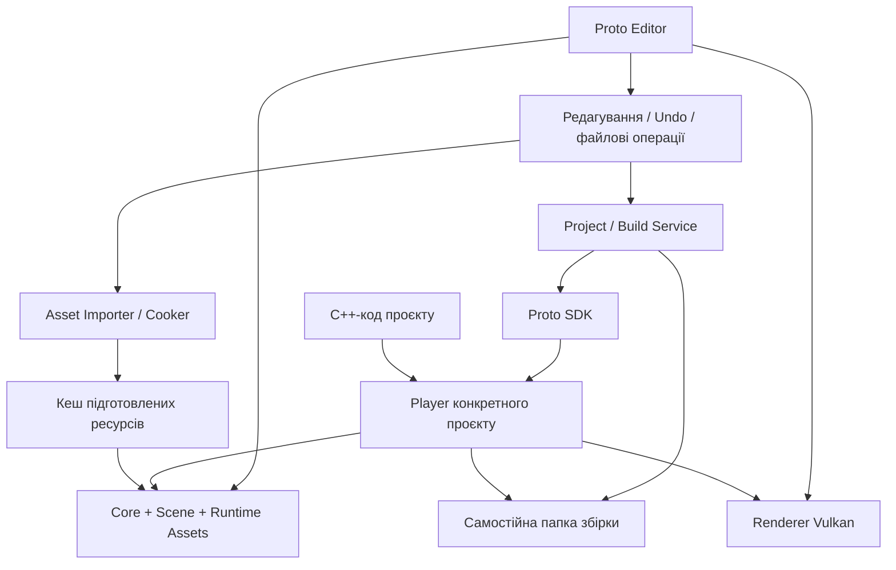

# Proto Engine v0.1 — технічна архітектура

Дата: 2026-09-08. Статус: технічний проєкт v0.1; M0–M4 реалізовано,
M5–M8 залишаються планом. [Результати M0](M0_REPORT.md), [M1](M1_REPORT.md), [M2](M2_REPORT.md), [M3](M3_REPORT.md), [M4](M4_REPORT.md).
Функціональні вимоги погоджено у [FOUNDATION.md](FOUNDATION.md).
Рішення нижче є запропонованим способом їх реалізації; вони не означають,
що системи рушія вже написані або їх продуктивність виміряна.

## 1. Головні рішення

| Питання | Рішення для v0.1 | Причина |
| --- | --- | --- |
| Мова та збірка | C++20, CMake, Ninja, наявний MinGW-w64 GCC 16.2 | Використати перевірений локальний набір; однаковий інструментарій для SDK і коду проєкту. |
| Платформа | Windows x64; перевірка Windows 11, Windows 10 потребує окремого запуску | Узгоджена ціль готових програм. Платформні виклики ізольовані. |
| Графіка | **Vulkan 1.3**, один графічний backend | Контроль над пам'яттю, синхронізацією та підготовкою команд відповідає пріоритету масштабування. |
| Рендеринг | Forward+ із плитками екрана, instancing і кешуванням тіней | Відсікати непотрібну роботу й повторно використовувати дані. |
| Освітлення | PBR, напрямлене світло, точкові лампи; shadow mapping для обох типів | Виконує погоджену вимогу динамічних тіней. |
| Редактор | GLFW + Dear ImGui docking + власні маніпулятори GLM | Компактний нативний інтерфейс; світове переміщення та локальні обертання/масштаб без shear у TRS. |
| Сцена | Власний реєстр об'єктів і щільні сховища відомих компонентів | Контроль розміщення даних; ієрархія відділена від зберігання компонентів. |
| Код проєкту | Компілюється в окремий Player, статично зв'язаний із SDK | Редактор не завантажує довільні DLL проєкту. |
| Ресурси | Сталі UUID, метадані поруч із джерелом, відновлюваний індекс, кеш за хешем вмісту | Переміщення файлу не змінює його ідентичності. |
| Дані | Версійований UTF-8 JSON для редагування; підготовлені бінарні ресурси для виконання | Зручне збереження та передбачуване завантаження. |
| Вимірювання | CPU/GPU time, пам'ять, завантаження, кількість видимих об'єктів і тіньових проходів | Перевіряти ефект оптимізації за однакової якості. |

### Чому Vulkan, а не початковий кандидат OpenGL 4.5

OpenGL 4.5 технічно достатній для погоджених ефектів і пройшов локальну
перевірку. Його перевага тут — простіша реалізація та менша кількість
обов'язкових механізмів у самому рушії. Називати OpenGL завжди повільним некоректно.

Для Proto Engine головний пріоритет — ефективність та масштабування. Vulkan
передає застосунку явне керування командами, пам'яттю й залежностями роботи GPU.
На цій підставі обрано Vulkan 1.3; це **архітектурний вибір, а не результат
порівняльного тесту швидкодії**. Помилки синхронізації або невдалі розміри пакетів
можуть зробити Vulkan-реалізацію повільнішою.
[Khronos: What is Vulkan?](https://docs.vulkan.org/guide/latest/what_is_vulkan.html)
[Khronos: Vulkan essentials](https://docs.vulkan.org/samples/latest/samples/vulkan_basics.html)

Локальна Arc 140T повідомляє Vulkan 1.4.335. Окремий діагностичний процес уже
створив пристрій із запитом API 1.3, виконав compute-шейдер, synchronization2,
timeline semaphore та виділення пам'яті через VMA. Це підтверджує придатність
основи, але не замінює перевірку повного рендерера. Деталі —
[LOCAL_ENVIRONMENT.md](LOCAL_ENVIRONMENT.md).

OpenGL-backend не розробляємо паралельно у v0.1. Незалежні від Vulkan сцена,
ресурси та опис кадру залишають можливість додати інший backend пізніше.

## 2. Програми та модулі

Стрілки означають використання або підготовку даних; процес Editor не є
власником адресного простору Player.

| Модуль | Відповідальність | Чого в ньому немає |
| --- | --- | --- |
| `ProtoCore` | UUID, помилки, журнал, час, задачі, базові типи, платформа | Графічного API й редактора. |
| `ProtoScene` | Об'єкти, компоненти, ієрархія, dirty-стан трансформацій | ImGui та Vulkan-типів. |
| `ProtoAssetsRuntime` | Завантаження підготовлених ресурсів, handles, час життя | glTF/PNG/JPEG-імпортерів. |
| `ProtoRendererVulkan` | GPU-ресурси, видимість, світло, тіні, побудова кадру | Форматів проєкту та файлового Undo. |
| `ProtoRuntime` | Життєвий цикл сцени, введення, поведінка, запуск кадру | Редакторських команд. |
| `ProtoAssetTools` | cgltf, декодування зображень, тангенти, кеш, залежності | Виконання поведінки користувача. |
| `ProtoProjectTools` | Проєкти, збереження, транзакції файлів, збірка, пакування | Малювання сцени. |
| `ProtoEditor` | Панелі, selection, маніпулятори, історія дій, Play/Stop | Завантаження DLL з кодом проєкту. |
| `ProtoRuntimeUI` | Невелика панель графічних налаштувань і діагностики | Файлової панелі, імпорту й редагування сцен. |

Публічні заголовки SDK описують типи рушія. Vulkan, ImGui, cgltf та yyjson
не передаються через інтерфейс C++-поведінки. Компоненти мають звичайні
дані; доступ до GPU здійснюється через renderer на рівні кадру/пакета.

## 3. Сцена та її дані

### Ідентифікатори й сховища

- `EntityId` — сталий UUID у файлі сцени; `AssetId` — окремий UUID ресурсу.
- `EntityHandle {slot, generation}` — коротке посилання під час виконання.
  Видалений об'єкт не стає іншим об'єктом при повторному використанні slot.
- Transform, MeshRenderer, Camera, DirectionalLight, PointLight та BehaviorBinding
  зберігаються у щільних масивах із таблицею відповідності handle → index.
- Ієрархія — окремі parent/children-зв'язки. Цикли й посилання на відсутнього
  батька відхиляються до застосування зміни.
- Пошук UUID і рядкових назв потрібен при завантаженні, прив'язуванні та
  редагуванні; звичайний кадр обходить готові масиви й handles.

### Трансформації

Локальний стан — position, quaternion rotation, scale. Світова матриця
обчислюється від батька; зміна позначає потрібне піддерево dirty. Нормальна
матриця для нерівномірного масштабу оновлюється разом зі світовою.

Одиниця сцени — метр; система правостороння, `+Y` вгору, камера дивиться вздовж
локальної `-Z`. Дані glTF зберігають цей зміст. Для Vulkan фіксуємо depth `0..1`
та єдине перетворення Y через від’ємну висоту Vulkan viewport. Projection
залишається `perspectiveRH_ZO` без другого перевертання Y; winding перевірений
еталонним трикутником M0 і зіставленням CPU/GPU depth у M1. Маніпулятор
отримає ту саму view/projection-пару.

При переприв'язуванні до іншого батька стандартна дія зберігає світову
трансформацію, якщо нові локальні дані можна представити TRS. Якщо виникає
shear або батьківська матриця вироджена, операція не змінює сцену мовчки:
редактор пропонує зберегти локальні параметри або скасувати переприв'язування.

Створення й видалення під час обходу сцени виконуються через чергу команд
на визначеній межі кадру. Безпосередня зміна положення чинного об'єкта
через setter позначає його transform dirty.

## 4. Ресурси та імпорт

### Ідентичність і вміст

`AssetId` відповідає на питання «який це ресурс», SHA-256 — «яка версія його
вмісту». Однакові байти різних ресурсів можна зберігати в одному незмінному
cache blob, зберігаючи незалежні UUID.

Джерело має JSON-sidecar `.meta`. Він містить UUID, тип, налаштування імпортера,
підресурси та зв'язки із залежностями. `.proto/registry.json` — відновлюваний
індекс, а не єдине місце зберігання UUID. Внутрішні `.meta` та `.proto` не
змішуються зі звичайним списком файлів у редакторі.

### Послідовність імпорту

1. Зовнішній файл і його локальні залежності копіюються в обрану папку проєкту.
2. Імпортер перевіряє структуру, розміри, індекси та обов'язкові розширення.
3. glTF перетворюється на опис моделі, meshes, матеріали й текстури зі сталими
   підресурсними UUID у `.meta`.
4. Відсутні тангенти для normal map генеруються MikkTSpace; дані перевіряються
   на коректність. Помилка не замінює чинну версію ресурсу порожнім об'єктом.
5. Підготовлені дані записуються в кеш із ключем, що включає вміст залежностей,
   версію імпортера й налаштування обробки.
6. Готова версія публікується в реєстрі; GPU-завантаження йде окремою чергою.

Інстанціювання моделі створює об'єкти її вузлів з новими EntityId, але спільними
посиланнями на mesh/material-ресурси. Структура імпортованої моделі не втрачається.
Редагування матеріалу з GLB зберігається як native override у метаданих або
окремому `.material.json`, без переписування великого GLB при зміні повзунка.

Підресурсні UUID не виводяться лише з номера glTF-вузла. При повторному імпорті
однозначні відповідності зберігаються; неоднозначна зміна структури потребує
явного зіставлення, з утриманням попередньої придатної версії до вирішення.

### Підтримка v0.1

- glTF 2.0, GLB, трикутні meshes, вузли та їх статичні трансформації.
- Позиції, нормалі, UV, індекси, тангенти; multiple primitives/material slots.
- PNG/JPEG, зовнішні файли, GLB buffer views і data URI в межах перевірених лімітів.
- PBR metallic/roughness, base color, normal map; `OPAQUE`, `MASK`, double-sided.
- Мінімально корисні glTF texture samplers та `KHR_texture_transform`.
- Непідтримане обов'язкове розширення — зрозуміла помилка імпорту.
  Відкладена анімація/BLEND не отримують мовчазної заяви про повну підтримку.

Список підтримки фіксується в importer manifest і перевіряється окремими
ресурсами. cgltf є парсером, а не обіцянкою підтримки всіх розібраних ним ефектів.
[cgltf](https://github.com/jkuhlmann/cgltf)

### Файлові операції

Переміщення переносить ресурс разом із `.meta`; UUID зберігається. Для `.gltf`
зовнішні URI-залежності відстежуються за UUID. При зміні шляху джерела або
залежності відповідні URI у копіях файлів усередині проєкту оновлюються
в межах тієї ж транзакції.

Копія отримує нові UUID ресурсу та його підресурсів. Для копії групи файлів
посилання всередині групи переводяться на копії; посилання поза групою
залишаються на існуючих ресурсах. Redo використовує UUID, видані початковій дії.

Зміна файлів поза редактором запускає повторну перевірку індексу. Знайдений
sidecar дозволяє відновити шлях; без надійної відповідності редактор показує
відсутній ресурс і пропонує relink. UUID не вгадується лише за назвою файлу.
Переміщення C++-файлу не означає автоматичного переписування його `#include`.

## 5. Збереження та Undo/Redo

Усі зміни редактора проходять через команди з precondition, redo та undo.
Перетягування накопичує проміжні значення, а в історію потрапляє одна команда
з початковим і кінцевим станом. Видалення піддерева зберігає його невеликі
дані й AssetId, а не копії геометрії й текстур.

Сцену спочатку серіалізуємо й перевіряємо в пам'яті, потім записуємо тимчасовий
файл поруч із цільовим і замінюємо його з резервною попередньою версією.
Позначка незбережених змін зникає лише після успішного запису.

Багатофайлова операція не є автоматично атомарною. Для неї використовується
журнал `.proto/transactions/<id>/`: план, контрольні суми початкового стану,
staged-файли, виконані кроки та commit. При збої виконуються компенсації;
після перезапуску незавершений журнал відновлюється до узгодженого стану.

Конфлікт імен пропонує нову назву або скасування. Undo не перезаписує файл,
який після операції було змінено зовні: редактор показує конфлікт. Шляхи
канонізуються; операція не виходить із папки проєкту через `..` або reparse point.
Історія має ліміт пам'яті й зберігає файлові backup-дані на диску до видалення
відповідного запису історії. Закриття проєкту завершує історію сесії.

## 6. C++-поведінка, SDK і Player

### Інтерфейс

Поведінка має `OnStart`, `OnUpdate(dt)`, `OnStop`. Параметри описуються явно:
тип, стала назва поля, значення за замовчуванням, діапазон та спосіб показу.
Початкові типи: bool, integer, float, string, Vec3, color, EntityRef, AssetRef.

Тип поведінки має сталий `BehaviorTypeId`. Зміна назви C++-класу не повинна
автоматично змінювати цей ID. Реєстрація виконується через одну явну функцію
проєкту `RegisterProjectBehaviors(BehaviorRegistry&)`, без сканування пам'яті
й без парсингу C++-коду редактором.

Редактор одержує опис типів, запускаючи вже зібраний Player із параметром
`--describe-behaviors`. У цьому режимі немає вікна, GPU й викликів поведінки;
виконується реєстрація типів. Результат — версійований JSON-контракт.

### Збірка

SDK містить заголовки, статичні бібліотеки, CMake package та ідентифікатор
toolchain/build. Player компілюється з кодом конкретного проєкту й статично
зв'язується з SDK. Редактор не підтримує hot reload DLL у v0.1.

Ключ кешу компіляції включає версію SDK, compiler identity, конфігурацію,
прапори та вміст джерел. Несумісний SDK/компілятор дає діагностику до запуску.
Release збирається з переносною ціллю x86-64, без залежності від `-march=native`.
LTO та агресивні прапори вмикаються після вимірювання й перевірки коректності.

Помилки компіляції показуються в панелі журналу з переходом до файла й рядка.
Невдала збірка не запускає старий executable під виглядом щойно зібраного.

### Play/Stop

Стани: `Editing → Preparing → Running → Stopping → Editing`; помилка з будь-якого
етапу повертає редактор до придатного стану з повідомленням.

1. На Play фіксуємо revision сцени та незмінний manifest ресурсів.
2. Якщо C++-код змінився, виконуємо інкрементальну збірку з можливістю скасування.
3. Player стартує окремим процесом із тимчасовою сценою та manifest.
4. Проєктні зміни в редакторі на час запуску блокуються, журнал і Stop доступні.
   Постійне перемальовування редакторського 3D-виду призупиняється.
5. Stop надсилає керований запит завершення; завислий дочірній процес можна
   завершити окремо. Стан редагування не замінюється станом виконання.

Незмінні cache blobs закріплюються до завершення Player. Їх не потрібно
дублювати в папку snapshot. Незалежні процеси можуть дублювати GPU-ресурси;
ця пам'ять вимірюється окремо. Ізоляція процесу захищає від звичайного збою
C++-логіки, але не є sandbox для довільних зовнішніх дій цього коду.

## 7. Рендерер Vulkan

### Базовий контракт пристрою

API 1.3, `VK_KHR_swapchain`, graphics/compute/present queue, dynamic rendering,
synchronization2, timeline semaphores та sampled depth cube arrays.
Формати HDR/depth і потрібні ліміти перевіряються під час запуску. VMA керує
suballocation; `VK_EXT_memory_budget`, якщо доступний, дає бюджет пам'яті.
Немає вимоги RT, mesh shaders або bindless для першого backend.

Два кадри в роботі; ресурси кожного кадру перевикористовуються після його
завершення. Команди записуються пакетами. `vkDeviceWaitIdle` не використовується
у звичайному кадрі; знищення GPU-ресурсів відкладається до завершення їх роботи.
Початково одна graphics/compute queue; додаткові черги вводяться лише за
виміряної користі. [Vulkan Memory Allocator](https://github.com/GPUOpen-LibrariesAndSDKs/VulkanMemoryAllocator)

GLSL заздалегідь компілюється в SPIR-V. Graphics/compute pipelines створюються
для обмеженого набору варіантів, а не для кожної зміни кольору матеріалу.
Pipeline cache прив'язується до device/driver UUID, версії renderer та хешів
шейдерів; несумісний кеш ігнорується. Підготовка відсутніх pipelines виконується
поза звичайним обходом об'єктів; час першого запуску й warm-start вимірюються окремо.

### Проходи кадру

1. Застосування змін сцени, оновлення dirty-трансформацій та bounds.
2. Відсікання невидимих об'єктів; формування пакетів mesh/material/стану.
3. Оновлення потрібних динамічних карт тіней.
4. Depth prepass для `OPAQUE` і `MASK` з тією самою геометрією й альфа-маскою.
5. Compute-формування списків точкових ламп для плиток екрана (початково 16×16).
6. PBR-затінення видимих пакетів у HDR із доступом до потрібних джерел і тіней.
7. Tone mapping і вибрані прості налаштування якості; редакторський/runtime UI.

Зовнішній renderer interface приймає snapshot/пакети даних. Сцена не викликає
Vulkan для кожного об'єкта. Спільна геометрія повторних об'єктів завантажується
один раз, трансформації передаються через instance buffer.

Списки світла не обрізаються мовчки. Переповнення плитки має коректний
повільніший шлях або перевиділення буфера; результат освітлення зберігається.
Непотрібні видимому кадру джерела й геометрія відсікаються консервативно.

### Сонце

Cascaded shadow maps: кількість каскадів, resolution і shadow distance задані
профілем якості. Проєкція стабілізується відносно texel grid. Враховуються
об'єкти, які можуть відкидати тінь на видиму сцену, навіть якщо самі вони
поза кадром. Нормальний/depth bias, фільтрація й межі каскадів перевіряються
на близьких, віддалених і тонких об'єктах.

### Точкові лампи

Для лампи будується шість depth-проєкцій; вони зберігаються в cube-array pool.
`MASK` і double-sided враховуються у тіньовому проході. Затінення визначається
поточною геометрією, а не намальованою плямою.

Ключ придатності кешу враховує положення й радіус лампи, потрібні caster revisions,
версії mesh/alpha-матеріалів і налаштування тіні. Зміна лише кольору лампи
не потребує повторного depth-pass. Рух caster позначає джерела, чиї області
перетинають старі або нові bounds. Зміна батька/геометрії/маски також інвалідує кеш.

Dirty-карта, потрібна видимому кадру, оновлюється перед її використанням.
Оновлення раз на декілька кадрів не підміняє погоджену динамічність.

Pool обмежує пам'ять, а не загальну кількість здатних відкидати тінь ламп.
Якщо всі активні карти не вміщаються, світло обробляється кількома пакетами:
карти пакета → його освітлення в HDR → наступний пакет. Базове освітлення
додається один раз, внески ламп накопичуються; tone mapping виконується наприкінці.
Цей шлях може бути повільнішим, але не відключає тіні без вибору користувача.

Еталонні перевірки порівнюють один і декілька пакетів, кешований і примусово
оновлюваний режими. Ліміт pool враховує формати, шість faces на куб і бюджет GPU.
[Khronos: Vulkan image creation](https://docs.vulkan.org/refpages/latest/refpages/source/VkImageCreateInfo.html)

## 8. Продуктивність і якість

Структурні рішення вводяться відразу: щільні дані, dirty-оновлення, спільні
ресурси, імпорт поза кадром, пакетне GPU-завантаження, culling, instancing,
обмежений пул задач і повторне використання scratch-буферів.

Початковий worker pool — до чотирьох задач одночасно з резервом для UI/render;
точна кількість підбирається за профілем, а не дорівнює безумовно всім CPU cores.
Паралельний запис Vulkan command buffers додається там, де CPU-вимірювання
показують користь; дрібні command buffers не створюються на кожний об'єкт.

Профілі якості доступні в редакторі та через невелику панель Player. Параметри:
render scale, VSync, дальність огляду/тіней, роздільність і фільтрація тіней,
бюджет pool, верхні mip-рівні текстур. Balanced є початковим набором параметрів
для тестів, не гарантією певного FPS. Автоматичного прихованого зниження якості немає.

Редактор у спокої очікує подій, а 3D-вигляд перемальовується за змінами.
Інтерактивна камера й Player мають безперервний цикл із налаштованим frame pacing.
Показники CPU, GPU і пам'яті редактора та Player не змішуються в одне число.

Детальна методика й сцени — в [IMPLEMENTATION_PLAN.md](IMPLEMENTATION_PLAN.md).
«Максимально оптимізовано» не є абсолютною гарантією: у звіті вказуються
перевірений масштаб, умови, витрати й наступне виміряне вузьке місце.

## 9. Пакування готового проєкту

Build готує нову папку зі своїм manifest, `.exe`, підготовленими ресурсами,
SPIR-V shaders, конфігурацією й notices залежностей. C++/glTF-імпортери,
компілятор шейдерів та редакторські панелі в готовій програмі не потрібні.

Пакуються залежності стартової сцени й явний список додаткових ресурсів,
потрібних C++-коду. Ресурси, які код завантажує динамічно, декларуються в
проєкті — їх не намагаємося вгадати з тексту C++.

Player шукає Data відносно свого executable, а не робочої папки shell.
Vulkan loader та драйвер надаються системою; SDK не потрібний на цільовому ПК.
Stage-папка публікується лише після перевірки manifest і залежностей. Попередня
успішна збірка зберігається до успішного завершення нової.

## 10. Межі перевіреного зараз

M1 додав `Scene`, sparse-to-dense component pools, generation handles,
dirty-трансформації й bounds, standalone scene JSON, команди редактора та
3D viewport із shared indexed geometry й instance buffers. Є фокус, orbit/pan,
CPU picking, frustum culling, inspector, Undo/Redo, native Open/Save dialogs.
Save As створює новий Scene AssetId зі сталими локальними EntityId.

Працює M0 Editor: GLFW, Vulkan 1.3 swapchain, dynamic rendering, два кадри
в роботі, окремі viewport color/depth images, ImGui Vulkan backend, docking,
український шрифт, DPI та clipboard. Readback перевіряє winding/Y/depth.
Debug пройшов перевірку core + synchronization validation без помилок.

Validation 1.4.357.0 знаходиться лише в локальному кеші та Debug output;
`VK_LAYER_PATH` задається самим Debug-процесом. Системний SDK не встановлено.
Геометрія M1 — Unlit із кольорами граней для орієнтування.

M2 додає `proto_assets_runtime` (типи, спільний каталог, BVH picking),
`proto_asset_tools` (cgltf, stb_image, MikkTSpace, metadata/registry/cooked cache),
`AssetRenderer` (PBR, mip textures, shared mesh buffers, instanced batches).
Парсинг і декодування нового імпорту виконуються одним worker job. Каталог
отримує готовий bundle на головному потоці; GPU upload обмежено 4 MiB за кадр.
Ресурси попередніх кадрів утримуються до відповідних fences. Однакові mesh UUID
використовують спільні buffers; пікселі текстур розділяються за hash і колірною роллю.
Студійний режим M2 збережено для перегляду матеріалів і регресійних перевірок.

M3 додає спільну `proto_lighting_math`, сценові компоненти світла та проходи
`AssetLighting.inl`: MASK-aware camera depth → базовий HDR → карти тіней пакета →
compute-списки 16×16 → PBR-внесок пакета → tone mapping → редакторські лінії.
Один набір instance data завантажується за кадр; кожен прохід використовує
власний компактний список індексів та instanced draw groups.

Кожна плитка зберігає 64 індекси; переповнення обробляється повним списком
ламп пакета й відображається лічильником. Освітлення одним пакетом використовує
RGBA16F; кілька пакетів переводять HDR кадру в RGBA32F, щоб дрібні внески не
губилися при багатьох округленнях. За сталого розміру viewport підвищена точність
зберігається, щоб перетин межі видимості лампою не спричиняв перевиділення щокадру.

Точкові карти використовують радіальну глибину та шість проєкцій із ближньою
площиною 0.005 м незалежно від радіуса. Сонце має практичні log/linear splits,
texel snapping із запасом покриття, overlap/blend каскадів та поправку глибини
до площини приймача для усунення acne на похилих поверхнях.

Ключ кешу охоплює mesh UUID і revision, світові трансформації, релевантні bounds,
double-sided/MASK, UV-перетворення, альфа-дані й фактичний sampler матеріалу.
Колір та інтенсивність світла не входять до ключа. Незмінні слоти зберігаються
при зменшенні кількості активних ламп; спільне зображення має явні read/write
barriers між пакетами й кадрами. Проходи, які тільки читають depth, використовують
`STORE_OP_NONE`. Окремі depth/PBR vertex shaders задають invariant position.

Player, повний файловий редактор, idle-перемальовування за подіями та порівняння
швидкодії Vulkan з іншими API залишаються майбутньою роботою.

Пов'язані документи: [формати даних](DATA_FORMATS.md),
[залежності](DEPENDENCIES.md), [план реалізації](IMPLEMENTATION_PLAN.md),
[локальна перевірка](LOCAL_ENVIRONMENT.md).
