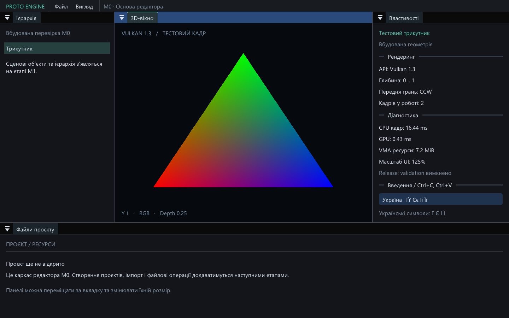

# Proto Engine — результат M0

Завершено **2026-09-08** на поточному Windows 11 x64 ПК з Intel Arc 140T.
GCC 16.2.0, CMake 4.4.2, Ninja 1.13.2. Етап M0 реалізовано; M1–M8 ще попереду.



## Що працює

- Нативне GLFW-вікно, Vulkan 1.3 device/swapchain та dynamic rendering.
- Два кадри в роботі, окремі color/depth viewport images, VMA allocations.
- Docking-панелі: 3D-вікно, ієрархія, властивості й нижня панель файлів.
- Системний Segoe UI з українськими символами, масштабування шрифту й відступів,
  системний clipboard. Шрифт не копіюється до збірки.
- Збереження docking layout у `bin/settings/editor.ini` під час звичайних запусків.
- Resize, minimize/restore, native close, повторний запуск. Згорнуте вікно
  очікує подій, рендеринг у цей час не виконується.
- Debug core + synchronization validation, журнал і CPU/GPU markers.
- Справжній GPU readback viewport color/depth та PNG усього клієнтського кадру.

Файлова панель та ієрархія поки позначені як каркас. Проєкти, сценові об’єкти,
збереження сцен, імпорт, PBR, освітлення та тіні не входять у M0.

## Перевірки

| Сценарій | Debug | Release |
| --- | --- | --- |
| CMake + GCC build | пройдено | пройдено |
| `m0_gpu_window`, 82 кадри | пройдено | пройдено |
| `m0_reopen`, окремий процес, 12 кадрів | пройдено | пройдено |
| Resize 1700×1075 → 1000×700 → 1440×900 | пройдено | пройдено |
| Minimize ≥ 250 ms, без нових кадрів, restore | пройдено | пройдено |
| Закриття через native `WM_CLOSE` та GLFW callback | пройдено | пройдено |
| Українські glyphs Ґґ Єє Іі Її | пройдено | пройдено |
| UTF-8 clipboard set/get, попередні формати відновлено | пройдено | пройдено |
| Масштаб UI: системні 125% → 187.5% → 125% | пройдено | пройдено |
| GPU color/depth/winding readback | 5/5 | 5/5 |
| Core + synchronization validation | 0 errors, 0 warnings | вимкнено |

Обидва CTest-набори: **2/2**. Автоматичні запуски не переписують користувацьке
розташування панелей. Clipboard-проба не записує його вміст у журнал; якщо
поточні формати не можна повністю скопіювати, вона пропускає запис і вказує це
у звіті. У фактичних запусках set/get та відновлення пройшли.

Перевірочна геометрія має кольоровий передній трикутник на depth 0.25,
намальований після нього задній жовтий трикутник на 0.75 і маленький трикутник
зі зворотним winding. Пікселі підтверджують зелений верх, червоний лівий низ,
синій правий низ, видимість передньої грані, відсікання задньої та коректний
depth test. Clear depth дорівнює 1.0. Ці перевірки виконуються на даних GPU.

Збережені результати:

- [Debug smoke](research/m0-debug.json), [Debug reopen](research/m0-debug-reopen.json).
- [Release smoke](research/m0-release.json), [Release reopen](research/m0-release-reopen.json).
- [Кадр редактора](research/m0-editor.png), [збільшений UI](research/m0-editor-scaled.png).

Release loader також повідомляє про невдалий пошук стороннього layer manifest
у registry — це попередження вже було в початкових probes. Воно зберігається
окремо як `loader_warnings`; registry не змінювався. Debug-перевірка з локальним
`VK_LAYER_PATH` пройшла без цього попередження.

## Ресурси й межі вимірювань

Використано FIFO presentation, без busy-loop при згортанні, без `vkDeviceWaitIdle`
у звичайному кадрі. Очікування всього device є при перебудові swapchain та
завершенні; це проста коректна основа M0. Present semaphore належить swapchain
image, а frame fence захищає повторне використання ресурсів кадру.

GPU timestamps охоплюють viewport + UI після очікування acquire, без present
і capture readback. CPU markers: `editor.ui` та `renderer.submit_present`;
другий включає presentation і, у кадрі захоплення, запис PNG. Час останнього
кадру у JSON — діагностичний зразок, не benchmark і не гарантія FPS.

При фінальному viewport тесту VMA allocations становили 7 750 144 байти
(близько 7.4 MiB). Це тільки ресурси, виділені нашим VMA allocator; сюди не
входять swapchain, ImGui backend, драйвер, зарезервовані блоки чи RAM процесу.
Розмір Release exe — близько 4.7 MiB. Таблиця DLL executable містить системні
Windows DLL; GCC runtime зв’язано статично. Vulkan loader читається динамічно.

Продуктивність великих сцен, слабший/інший GPU, Windows 10, фізичне перенесення
між моніторами з різним DPI та порівняння з OpenGL тут не перевірялися.

## Відтворення та запуск

```powershell
powershell -ExecutionPolicy Bypass -File scripts/Build.ps1 -Configuration debug -Test
powershell -ExecutionPolicy Bypass -File scripts/Build.ps1 -Configuration release -Test
```

Або після підготовки залежностей:

```powershell
cmake --preset debug
cmake --build --preset debug
ctest --preset debug
```

Запуск: `Launch-Editor.cmd` або `build/release/bin/ProtoEditor.exe`.
Звичайний журнал: `build/<configuration>/bin/logs/ProtoEditor.log`.
Звіти повторних тестів: `build/<configuration>/test-results/`.
Шейдери шукаються відносно executable, тому робоча папка запуску не важлива.

Перший configure завантажує тільки п’ять активних source-залежностей і glslang
за SHA-256. Debug setup тимчасово отримує офіційний підписаний пакет LunarG
на 288 MB, застосовує його документований режим `copy_only=1`, зберігає тільки
приблизно 22 MB validation DLL/manifest і notice та прибирає тимчасові файли.
Повний SDK не встановлюється; системні PATH, registry, `VULKAN_SDK` і Python
не змінюються. На цьому ПК `py -3 --version` залишається **Python 3.11.9**.

Окремий початковий діагностичний каталог цього сеансу
`%LOCALAPPDATA%/Temp/protoengine-m0-dependencies` залишився на диску:
автоматична перевірка відхилила його рекурсивне очищення з повідомленням
`blocked by policy`. Це тимчасові завантажені/розпаковані файли, не встановлений
SDK; робочий редактор їх не використовує. Власний тимчасовий каталог
`Setup-Validation.ps1` під `.cache/` був успішно прибраний самим скриптом.

Наступний етап за планом — **M1: сцена, ієрархія трансформацій та надійне
збереження**.
