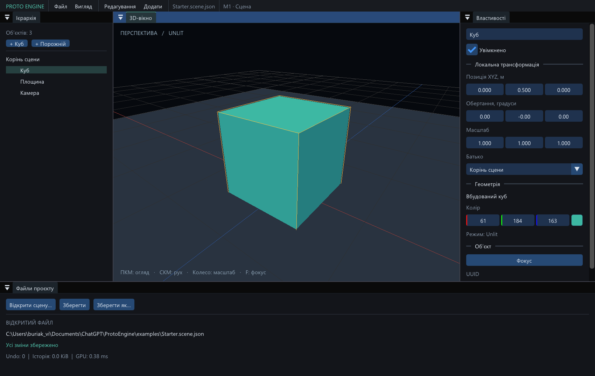

# Proto Engine — результат M1

Завершено **2026-09-08** на Windows 11 x64 / Intel Arc 140T із наявним
GCC 16.2.0, CMake 4.4.2 та Ninja 1.13.2. Новий Python або SDK не встановлювалися.

## Можливості

- Справжня 3D-сцена: куб, площина, перспективна камера, сітка та рамка selection.
- Огляд ПКМ, pan СКМ, wheel zoom, ПКМ + WASD/QE, Shift, фокус клавішею F.
- Вибір мишею у viewport і дереві; створення куба, площини, групи й камери.
- Ієрархія parent/children та drag-and-drop зміна батька зі збереженням world TRS.
  При shear/виродженому батьку є явний вибір local TRS або скасування.
- Назва, enabled, позиція, quaternion rotation через Euler-поля, масштаб,
  колір геометрії й параметри камери в інспекторі.
- Undo/Redo створення, видалення піддерева, властивостей, parent та active camera.
  Один drag — одна команда; нульова зміна не додає Undo. Історія поточної сесії.
- Native Open/Save dialogs, Ctrl+N/O/S, Save As, запит перед втратою незбережених змін.
- Standalone `.scene.json`, резервна попередня версія `.bak`, перевірка змін файла
  сторонньою програмою перед перезаписом відкритої сцени.

Початковий файл: [examples/Starter.scene.json](../examples/Starter.scene.json).
Після звичайного запуску без аргументів створюється нова незбережена сцена.
Для відкриття прикладу використовуйте меню Файл або `--scene <path>`.

## Основа даних і ресурсів

EntityId і AssetId — різні C++-типи. Короткі `{slot, generation}` handles не
серіалізуються й не стають новими об’єктами після видалення або load. Компоненти
лежать у щільних масивах зі sparse lookup. Незмінені world matrices не
переобчислюються; зміни зачіпають відповідне піддерево. Є world bounds і normal
matrix для нерівномірного масштабу; вироджені meshes пропускаються.

Куби й площини посилаються на одну спільну геометрію кожного типу. GPU одержує
instance buffers, які повторно використовуються після frame fence. Об’єкти
групуються за геометрією й winding; є frustum culling. Picking використовує
обернену world matrix та узгоджується з односторонньою площиною й backface culling.
CPU-промені для перевірки depth запускаються тільки при запитаному capture.

Історія зберігає властивості та AssetId, без копій GPU-геометрії. Межа payload:
64 MiB та 512 команд. Надто велике видалення відхиляється до зміни сцени;
його можна виконати частинами. Це ще не файлове Undo/Redo етапу M4.

## Збереження

Loader перевіряє UTF-8, типи, версію, дублікати полів/ID, посилання, цикли,
числа, quaternion та camera ranges. Сцена-кандидат публікується лише після
повної перевірки. Пошкоджений або майбутній документ не замінює чинний стан.

Save серіалізує перевірені дані, створює у тій самій папці унікальний temporary
файл, записує й виконує `FlushFileBuffers`, готує `.bak` із попередніми байтами,
потім замінює основний файл через same-volume `MoveFileExW`. Copy/delete fallback
для основного файла не використовується. [Microsoft: MoveFileExW](https://learn.microsoft.com/en-us/windows/win32/api/winbase/nf-winbase-movefileexw).

`*.lock` створюється виключно для поточної операції й видаляється ОС при закритті
handle. Наявний чужий lock не змінюється. Позначка dirty, новий шлях і SceneId
оновлюються тільки після успіху запису. Save As іншого файла дає новий SceneId
зі сталими EntityId, а початковий файл залишається цілим.

Це публікація одного документа. Backup і основний файл не є спільною
багатофайловою транзакцією; `.bak` може вже оновитися при відмові останнього rename.
Power-loss, disk-full, мережеві файлові системи й гонки з програмами, що
ігнорують lock, окремо не перевірялися. Багатофайлові транзакції належать M4.

## Перевірки та результати

| Перевірка | Debug | Release |
| --- | --- | --- |
| CTest, весь набір | 5/5 | 5/5 |
| Контракт сцени, окремі сценарії | 20/20 | 20/20 |
| Legacy M0 triangle + window/reopen | пройдено | пройдено |
| Native M1 hierarchy/edit/delete/Undo/save/reopen | пройдено | пройдено |
| Клік по кубу через ImGui input queue | пройдено | пройдено |
| Drag координати → один Undo → Redo | пройдено | пройдено |
| GPU depth проти CPU ray/box oracle | 21/21 samples | 21/21 samples |
| Core + synchronization validation | 0 errors, 0 warnings | вимкнено |

20 сценаріїв включають parent rotation/non-uniform/negative scale, bounds,
dirty subtree, cycle/unknown/duplicate IDs, invalid UTF-8/quaternion/camera,
майбутню версію, stale handles після reuse/load, Undo піддерева, no-op gesture,
saved-state/redo branching, `.bak`, blocked-file write, failed-load rollback,
external-edit conflict, empty target, foreign lock, Save As та CPU picking.

Дані тестів створені самим рушієм. UI-проби подають події у реальну ImGui
чергу й проходять через viewport/інспектор; вони не рухають системний курсор.
Повний ручний тест native файлових діалогів не входив до автоматичного набору.

- [Контракт сцени](research/m1-scene-contract.json).
- [Debug native](research/m1-debug.json), [Debug reopen](research/m1-debug-reopen.json).
- [Release native](research/m1-release.json), [Release reopen](research/m1-release-reopen.json).
- [Перевірка Starter](research/m1-starter.json), [UI зі збільшеним масштабом](research/m1-editor-scaled.png).

Поля `pixels` у звітах належать тільки діагностичному режиму M0. Для M1
оцінюються `scene_gpu`, `scene_saved_reopened` і `scene_ui_*`; false у полях
сценарію, який не запускався в reopen/Starter, не означає помилку цього запуску.

Release успадковує від системного loader попередження про сторонній registry
layer manifest, зафіксоване ще до M0. Воно окремо пораховане як `loader_warnings`;
registry не змінювався.

## Межі етапу

Зараз використовується **Unlit**, з різними кольорами граней для читабельності
форми. Це ще не PBR чи освітлення; динамічні тіні сонця й точкових ламп
залишаються обов’язковими в M3. Імпорт моделей — M2, повний файловий браузер
і файлове Undo — M4, C++ Player/Play — M5 та наступні етапи.

Локальний приклад не є benchmark великих сцен. Для native M1 кадру VMA
allocation bytes становили 7 764 288 (без swapchain/ImGui/драйвера/RAM процесу).
Розмір Release executable — близько 5.6 MiB. Таймери є діагностикою,
а не гарантією FPS або порівнянням з OpenGL. Інший GPU/ПК не перевірявся.

Команди повторення — у [README](../README.md). Поточні результати записуються
в `build/<configuration>/test-results/`; каталог `docs/research` містить
зафіксовані результати цього етапу.
