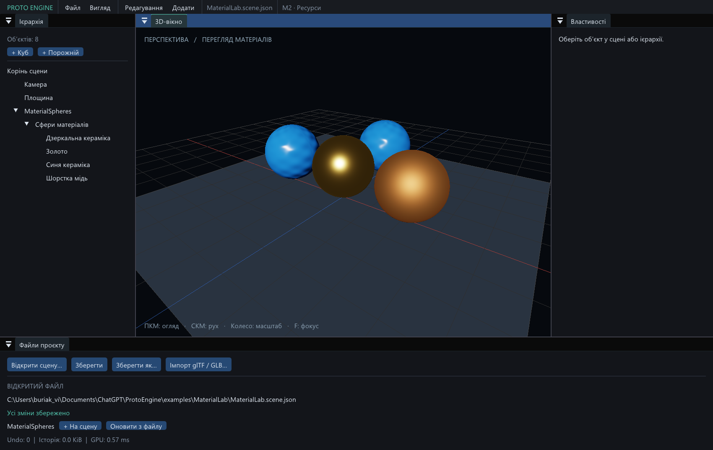

# Proto Engine — результат M2

Дата: 2026-09-08. Windows x64, GCC 16.2.0, Vulkan 1.3,
Intel Arc 140T. M2 реалізовано й перевірено в Debug та Release.



## Що працює

- Імпорт статичних glTF 2.0 / GLB через native файловий діалог у нижній панелі.
  Зовнішні `.bin`, PNG/JPEG, percent-encoded UTF-8 URI, base64 data URI та
  GLB image bufferView копіюються/декодуються в пакет ресурсів.
- Сталі source/mesh/material/texture UUID у `.meta`; registry відновлюється
  з metadata. Повторний імпорт однакового вмісту не дублює джерело.
- Ієрархія glTF, indexed geometry, normal/tangent generation через MikkTSpace,
  vertex color, UV0/UV1, normalized attributes, material slots.
- PBR metallic/roughness, base color, normal, AO та emissive maps;
  OPAQUE, MASK, double-sided, texture transforms і glTF Unlit.
  Color maps використовують sRGB, data maps — linear UNORM.
- Mip chains фільтруються в правильному колірному просторі, враховують непарні
  розміри, нормалізацію normals і coverage альфа-маски з урахуванням RGBA8.
- Металевість, шорсткість, базовий RGB і сила normal map редагуються в
  інспекторі. Preview працює під час руху; один gesture — одна Undo-команда
  та одне збереження overrides у `.meta`.
- Імпорт/reimport виконується одним worker. GPU upload використовує staging
  buffers і бюджет **4 MiB за кадр**; ресурси не декодуються кожного кадру.
- Instances ділять mesh buffers; однакові texture payloads ділять images.
  Draw batches групуються за mesh, slot, material і winding. Ресурси кадрів
  утримуються до fence; CPU picking використовує BVH й пропускає MASK-отвори.
- Save/reopen і Save As зберігають зв'язки ресурсів. Помилковий імпорт або
  невдале відкриття не замінюють живу сцену. Редактор повідомляє про помилки.

## Перевірки

| Набір | Debug | Release |
| --- | --- | --- |
| Повний CTest, M0–M2 | 8/8 | 8/8 |
| Контракти ресурсів | 17/17 | 17/17 |
| Контракти сцени M1 | 20/20 | 20/20 |
| Native glTF / GLB import, material Undo, shared instances, cache reopen | пройдено | пройдено |
| GPU color probes на кожен glTF/GLB запуск | 9/9 | 9/9 |
| GPU depth probes, зокрема MASK-отвори | 11/11 | 11/11 |
| Core + synchronization validation | 0 errors, 0 warnings | вимкнено штатно |

Чисельний double-precision CPU reference перевіряє фактичні GPU-пікселі:
normal map, mirrored double-sided normal, back face, flat reference, packed
MR-канали, звичайну й дзеркальну MASK, JPEG/UV transform та OPAQUE alpha.
Перевіряється і depth у прозорих отворах. Окрема 3D-сцена зі сферами оглянута
через PNG readback; її readback перевіряє nonempty/finite depth, без точного
кольорового oracle для кожного пікселя.

Контрактні тести також перевіряють втрачений/пошкоджений кеш, зміни геометрії
зі збереженням UUID, move source+meta, duplicate UUID, застарілу metadata при
пошуку дубля, зіпсовані залежності, required extensions, вихід URI за папку,
непідтриманий BLEND, slot overrides і незмінність сцени після failed load.
M0/M1 native тести повторно перевіряють resize/minimize/DPI/clipboard, вибір
об'єкта, inspector drag, Undo/Redo і save/reopen.

Докази: [Debug CTest](research/m2-debug-tests.log),
[Release CTest](research/m2-release-tests.log),
[Debug glTF](research/m2-debug.json), [Debug GLB](research/m2-debug-glb.json),
[Release glTF](research/m2-release.json), [Release GLB](research/m2-release-glb.json).
У Release лишається одне раніше відоме повідомлення системного Vulkan loader
про пошук layer manifest у registry; реєстр Windows не змінювався.

## Ресурси й вимірювання

Контрольна сцена: 18 mesh instances, **6 GPU meshes, 7 GPU images** включно з
двома default textures. VMA allocations — 27 789 696 bytes (~26.5 MiB).
Найбільший upload у виміряному кадрі — **4 193 760 bytes**, нижче 4 MiB.
Після стабілізації upload дорівнює нулю, повторне відкриття дає `decodedImages=0`.

Приклад [MaterialLab](../examples/MaterialLab/README.md) має чотири сфери,
**1 GPU mesh** і 3 GPU images включно з defaults; перевірено в Debug і Release.
Це перевірка sharing та правильності, а не benchmark великих сцен або обіцянка
FPS на будь-якому обладнанні. Raw-звіти містять останні CPU/GPU timings;
вони залежать від FIFO present, поточного навантаження й частот GPU.

Ресурси створено власним детермінованим C++-генератором
`tests/AssetFixtures.cpp`. [SHA-256, джерело й ліцензія](research/m2-fixtures-manifest.md).
Новий Python чи SDK не встановлювали; Python користувача не переналаштовували.

## Межі етапу

Освітлення M2 — фіксоване студійне для перегляду матеріалів. Сценові сонце,
point lights і повноцінні динамічні shadow maps належать до **M3**. Вбудовані
cube/plane лишаються Unlit. Ray tracing відкладено за погодженим планом.

Підтримуються статичні TRIANGLES, OPAQUE/MASK і UV0/UV1. BLEND, skeletal/morph
meshes і невідомі required extensions відхиляються. Декодерів Draco/KTX/meshopt немає.
Optional extensions використовують core fallback із повідомленням; animation
tracks і glTF cameras пропускаються з повідомленням. Матриці вузлів мають бути
декомпонованими в TRS без shear/виродження. У вже створених native entities
нульовий масштаб дозволений і пропускає геометрію, як у M1.

Редагування alpha/cutoff, прив'язки текстур та інших факторів — через джерело й
reimport. MASK picking читає mip 0: на віддалених дрібних краях він може
відрізнятися від відфільтрованого GPU mip. Для одного source package діють
ліміти: 256 MiB на вхідний файл, 8192×8192 на texture, 512 MiB decoded image
budget і 512 MiB cooked cache; це обмеження поточного імпортера.

Новий імпорт і reimport працюють у worker; native Open scene поки синхронний
і при втраченому кеші може чекати на його відбудову. Оновлення зі зміненою
структурою потребує нового source import, щоб не перепризначати UUID.
Закриття редактора дочікується поточного worker. Автоматичний file watcher,
повний project manifest, файлова навігація/copy/move з Undo та Player ще попереду.

## Запуск

`Launch-Editor.cmd` надає перевагу `build/m2-release/bin/ProtoEditor.exe`.
Приклад: `examples/MaterialLab/Launch-MaterialLab.cmd`.

```powershell
powershell -ExecutionPolicy Bypass -File scripts/Build.ps1 -Configuration m2-release -Test
powershell -ExecutionPolicy Bypass -File scripts/Build.ps1 -Configuration m2-debug -Test
```

Повний виконаний контракт ресурсів описано в [DATA_FORMATS.md, розділ 11](DATA_FORMATS.md#11-реалізований-контракт-m2).
