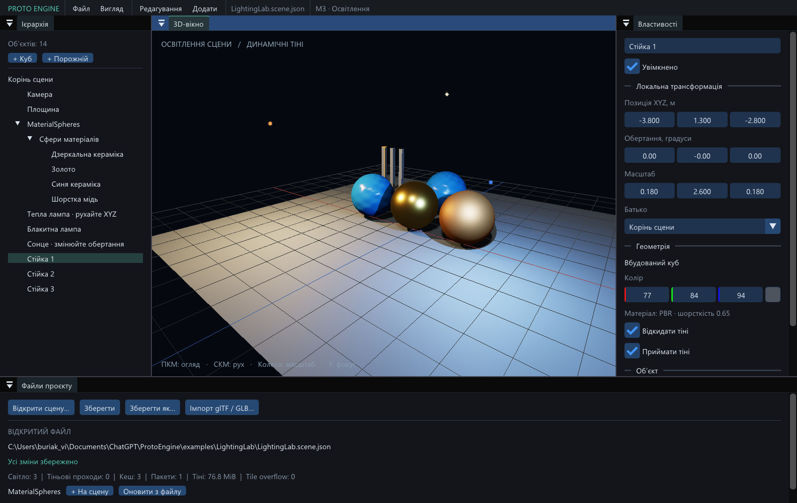

# Proto Engine — результат M3

Дата: 2026-09-08. **M3 завершено й перевірено в Debug та Release.**
Windows x64, GCC 16.2.0, Vulkan 1.3, Intel Arc 140T.



## Що працює

- Сонце з 1–4 стабілізованими каскадами та точкові лампи із шістьма картами
  радіальної глибини. Карти будуються з поточної геометрії, включно з MASK,
  double-sided, дзеркальним масштабом і об'єктами поза камерою.
- Зміна положення лампи, геометрії, батьківської трансформації, маски або sampler
  оновлює потрібні карти до їх використання. Зміна кольору/інтенсивності,
  включно з нульовою інтенсивністю й поверненням, не перемальовує незмінну глибину.
- PBR-світло накопичується в HDR. Базовий колір, ambient/emissive та tone mapping
  виконуються один раз; надлишок ламп обробляється додатковими пакетами.
- Плитки 16×16 мають GPU-списки до 64 індексів. Переповнена плитка використовує
  весь список ламп пакета, а лічильник переповнень видимий у редакторі.
- Редактор додає й вибирає лампи, показує їхні позначки, редагує колір,
  інтенсивність, радіус та тіні. Є графічні профілі, параметри карт/каскадів,
  дальність, фільтрація й бюджет пам'яті. Параметри зберігаються зі сценою,
  підтримують Undo/Redo. Вбудовані cube/plane тепер також використовують PBR.
- Нові сцени містять сонце. Попередній студійний режим і діагностика M0–M2
  збережені; Python або додатковий SDK не встановлювалися.

Запуск: [LightingLab](../examples/LightingLab/Launch-LightingLab.cmd) або
[звичайний редактор](../Launch-Editor.cmd). Для руху світла оберіть теплу лампу
й перетягніть її X/Y/Z в інспекторі. Для сонця змінюйте обертання.

## Перевірки

| Набір | Debug | Release |
| --- | --- | --- |
| CTest, усі M0–M3 | 12/12 | 12/12 |
| Математика кубічних карт, culling та CSM | 6/6 | 6/6 |
| Контракти світла, JSON, історія, save/reopen | 6/6 | 6/6 |
| Native сценарії освітлення | 18 | 18 |
| Захоплені й перевірені кадри освітлення | 84/84 | 84/84 |
| Проби RGB; стільки ж перевірок глибини | 13 438/13 438 | 13 438/13 438 |
| Найбільше відхилення RGB від CPU, шкала 0–255 | 0.5632 | 0.5632 |
| Повні порівняння зображень | 31/31 | 31/31 |
| Найбільша різниця повних порівнянь | 1/255 | 1/255 |
| Core + synchronization validation | 0 errors / 0 warnings | вимкнено штатно |

CPU reference незалежно рахує променеву видимість, GGX/Smith/Schlick, attenuation,
ACES і sRGB. Тестуємо піксельні центри на площині; навколо проби променева
видимість кожної лампи має бути сталою, щоб чисельний тест не змішував
внутрішню область тіні з дискретною межею shadow map/PCF. Це не повний
попіксельний ray tracer сцени. Повні GPU-порівняння додатково охоплюють краї,
моделі й усі інші пікселі між двома режимами одного положення.

Сценарії включають окремо рух лампи та рух caster при нерухомій лампі,
дочірні лампи/геометрію рухомих батьків, MASK для обох типів світла,
камерою відсічений caster, радіус лампи 10 000 м із близькою геометрією,
зміну mesh revision, заміну cube → plane, alpha cutoff, sampler REPEAT → CLAMP,
cast/receive toggles, нульову інтенсивність, reference path і переповнення плитки.

## Тіні в русі

[Відкрити автономний переглядач 24 положень](research/m3-motion.html).
У ньому збережені оригінальні PNG з GPU; інтернет не потрібний. Можна
відтворювати послідовність, пересувати повзунок і перемикати два режими.

Для кожного положення виконано два кадри з однаковими трансформаціями:
кешоване оновлення та примусове оновлення карт. **Усі 24 пари збігаються точно.**
Лампа, батьківські об'єкти й камера рухаються між парами; фільтрація ввімкнена.
Ключові фази руху оглянуто через PNG. Вбудований браузер Codex блокує локальні
`file://` URL, тому керування HTML-переглядачем у ньому не перевірено.
На низькій роздільній здатності край тіні залишається
дискретним; це реальні shadow maps із регульованою якістю, не ray tracing.

## Пам'ять і збереження всього світла

| Перевірка | Один пакет | Кілька пакетів | Результат |
| --- | --- | --- | --- |
| Сонце + 6 точкових ламп, 256 px | 7 слотів, 11 743 360 B | 1 слот, 1 679 488 B, 7 пакетів | ≤1/255; окремо з фільтрацією та без |
| 128 дуже слабких сонць | 128 слотів, 214 696 064 B | 1 слот, 1 679 488 B, 128 пакетів | точний збіг RGB |
| 137 ламп в одних плитках | GPU tile lists | повний reference list | точний збіг; 1072 переповнені плитки |

Тест слабких ламп також порівнює кадр із відсутнім світлом: внесок усіх ламп
справді збільшує яскравість. Для багатьох пакетів HDR підвищується до float32,
щоб округлення float16 не поглинало дрібні внески. Статичний кеш дає нуль
повторних shadow passes; у рухомій сцені потрібні карти оновлюються щокадру.

Бюджет обмежує поточний pool тіней за фактичним VMA allocation. Framebuffer,
HDR та ресурси моделей додаткові. При зміні якості попередня генерація живе
до завершення кадрів, які її використовували. Менший pool економить пам'ять
ціною більшої кількості проходів — він не гарантує однакового часу кадру.

У прикладі LightingLab: 3 лампи, карти 1024 px, 3 спільні GPU meshes,
3 images, pool 76.8 MiB, сумарні VMA allocations близько 112.1 MiB.
Останній теплий кадр Release: CPU 0.859 ms, GPU 2.293 ms при viewport 989×738.
Це одиничне діагностичне вимірювання з FIFO/VSync, **не масштабний benchmark**.
Повторювані median/p95/p99 та великі сцени залишаються етапом M7.

## Перевірка коду та відтворення

Основний агент Astra виконав рендерер та інтеграцію; Luna з reasoning `max`
виконувала обмежені задачі сцени, UI, математичних тестів і CPU reference.
Незалежний Astra reviewer із `max` перевірив фактичний код та звіти;
суттєвих невиправлених зауважень не залишилося.

Виправлено виявлені перевіркою випадки: cache key без mesh UUID/sampler,
перевиділення pool при зменшенні числа ламп, відсікання близьких caster
при великому радіусі, запас CSM після snapping, синхронізацію read-only depth,
derivatives/LOD у MASK та світлових гілках. Окремо усунуто конфлікт розпакування
спільних залежностей між новими конфігураціями CMake; fresh configure зберігає
вже опубліковані заголовки, доки інші конфігурації їх читають.

```powershell
powershell -ExecutionPolicy Bypass -File scripts/Build.ps1 -Configuration m3-debug -Test
powershell -ExecutionPolicy Bypass -File scripts/Build.ps1 -Configuration m3-release -Test
```

Докази: [Debug CTest](research/m3-debug-tests.log), [Release CTest](research/m3-release-tests.log),
[Debug GPU](research/m3-debug.json), [Release GPU](research/m3-release.json),
[усі Debug кадри/метрики](research/m3-debug-lighting.json),
[усі Release кадри/метрики](research/m3-release-lighting.json),
[128 пакетів Debug](research/m3-debug-dim-batches.json),
[128 пакетів Release](research/m3-release-dim-batches.json),
[приклад Release](research/m3-lighting-lab.json).
SHA-256 executable та SPIR-V: [build manifest](research/m3-build-manifest.json).
Повні PNG й детальні журнали — у `build/m3-*/test-results/`.

Технічна основа: [Khronos — dynamic rendering і явна синхронізація](https://docs.vulkan.org/features/latest/features/proposals/VK_KHR_dynamic_rendering.html),
[read-only attachment store](https://docs.vulkan.org/refpages/latest/refpages/source/VkAttachmentStoreOp.html),
[правила shader derivatives](https://docs.vulkan.org/spec/latest/chapters/shaders.html).

Перевірено цей ПК з Intel Arc 140T. Інші GPU/Windows потребують окремих запусків.
Release має раніше зафіксоване попередження loader про системний manifest;
реєстр не змінювався. M4 (повний файловий редактор), Player/Play і пакування
самостійних проєктів залишаються наступними етапами.
