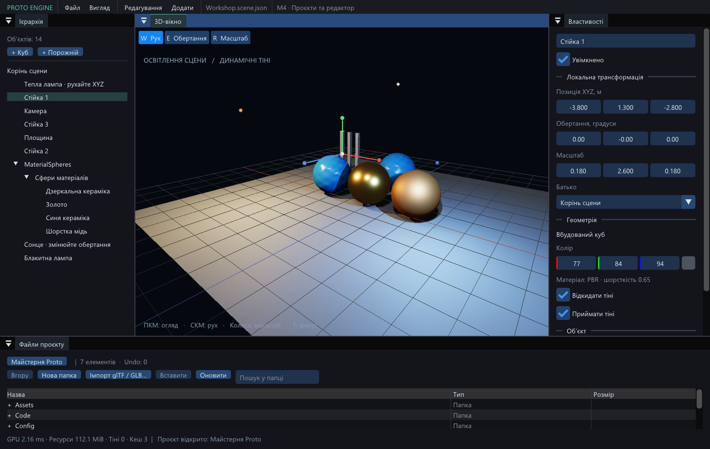

# Proto Engine — результат M4

Дата: 2026-09-08. **M4 реалізовано та перевірено в Debug і Release.**
Windows x64, GCC 16.2.0, Vulkan 1.3, Intel Arc 140T.

## Що працює

- Створення проєкту у вибраній папці, відкриття за папкою або manifest,
  початкова сцена за UUID, перевірка формату й один редактор на проєкт.
- Нижня файлова панель: навігація, пошук у поточній папці, вибір кількох
  елементів, нові папки, copy/cut/paste, rename, delete, перетягування до папок.
  Моделі можна перетягнути на сцену або додати подвійним кліком.
- Move переносить `.meta` й зберігає ID. Copy видає нові UUID ресурсів,
  переприв'язує внутрішні посилання групи, зберігає зовнішні та не змінює ID на Redo.
  Переміщення glTF/GLB коригує URI, включно з українськими назвами й пробілами.
- Файли й матеріали мають спільний порядок Undo/Redo з поточними сценовими
  редагуваннями. Файлова та матеріальна історія переживає зміну активної сцени.
  Перенесення відкритої сцени зберігає її UUID, вибір і незбережені зміни.
- Дискові before/after snapshots, контроль зовнішніх змін і журнал відновлення.
  Перевірені переривання redo, undo і самого відновлення між записами.
- W — світове переміщення, E — локальне обертання, R — локальний масштаб.
  Підтримуються неуніформні й від'ємні масштаби батьків. Один drag дає одну
  команду; Escape скасовує preview; відпускання поза viewport завершує drag.
- Події файлової системи оновлюють кеш браузера; сканування папок на кожному
  кадрі відсутнє. Маніпулятори використовують наявні GLM/ImGui без нової бібліотеки.

Запуск: [Майстерня Proto](../examples/ProtoWorkshop/Launch-Workshop.cmd) або
[редактор M4](../Launch-Editor.cmd). Для власного проєкту — **Файл → Новий проєкт…**.

## Перевірки

| Набір | Результат |
| --- | --- |
| Повний CTest Debug | 19/19, 114.60 s |
| Повний CTest Release | 19/19, 81.38 s |
| Файлові транзакції | 12 сценаріїв, включно з процесами, що примусово завершуються між кроками |
| Планування ресурсів | 14 сценаріїв, реальні apply/load/undo/redo, glTF та зовнішні URI у GLB |
| Документ / історія | 11 сценаріїв, межі проєкту, матеріальні snapshots, зміна сцен, preview та збереження |
| Проєкт / watcher | 9 сценаріїв, lock, повторне відкриття, пошкодження, живі журнали, lifecycle, відсутній `.proto` |
| Математика маніпуляторів | 6 сценаріїв |
| Нативні M4 workflow | Файлова панель і всі три маніпулятори, Debug та Release |
| Vulkan Debug | Core + synchronization validation: 0 errors, 0 warnings у перевірених native-сценаріях |

Журнали: [Debug](research/m4-debug-tests.log), [Release](research/m4-release-tests.log).
Зведення з SHA-256 готових програм: [m4-summary.json](research/m4-summary.json).
Нативні workflow: [Debug проєкт](research/m4-debug-project.json),
[Release проєкт](research/m4-release-project.json), [Debug маніпулятори](research/m4-debug-gizmo.json),
[Release маніпулятори](research/m4-release-gizmo.json).
Після додавання відтворення `.proto` повторені project-session та native-project
перевірки: [Debug](research/m4-debug-project-followup.log),
[Release](research/m4-release-project-followup.log). Фінальний native workflow
також перевіряє видалення невикористаної копії залежності:
[Debug](research/m4-debug-project-final.log), [Release](research/m4-release-project-final.log).
Ці ж фінальні запуски перевіряють відкриття `.SCENE.JSON` у верхньому регістрі;
відкидання втрати повного суфікса сцени перевірене у фінальних
[Debug](research/m4-debug-final-contracts.log) / [Release](research/m4-release-final-contracts.log) контрактах.

Нативний сценарій подає події у звичайні ImGui-обробники: Ctrl+C, кнопка
вставлення, F2 із текстовим введенням, drag/drop моделі. Окремо перевіряє змішану
історію, збереження/повторне відкриття, відмову видалити активну скопійовану
сцену через Undo, зовнішню зміну поточної сцени та невдалу публікацію кандидата.
Watcher проходить 100 негайних create/destroy і 50 завершень під час запису.
Незалежна перевірка коду Astra/max завершилася без матеріальних зауважень;
Luna/max працювала над модулями ресурсів, проєкту та маніпуляторів/документа.

## Ресурси й межі результату

Файлові payload копіюються потоками по 64 KiB на диск. Історія обмежена
512 командами / 64 MiB RAM; великі before/after файли не тримаються в Undo-пам'яті.
Файлові операції й відкриття сцен синхронні; на дуже великих групах можливі паузи.
Імпорт готується у worker, GPU-upload зберігає бюджет 4 MiB на кадр.

У 240 кадрах Release-прикладу редакторський UI мав середній CPU marker
**0.75 ms**, останній GPU timer — **2.18 ms**, VMA allocation — близько **112.1 MiB**.
У сталому кадрі три джерела світла використовували кеш тіней без нових depth passes.
Це вимірювання невеликого прикладу з VSync, не тест великих сцен чи гарантія FPS.
[Результат](research/m4-workshop.json), [журнал](research/m4-workshop.log).
Debug-приклад також пройшов readback і validation: [результат](research/m4-workshop-debug.json).

Перевірені завершення процесів, не фізичне вимкнення живлення. Папки з
непланованими `.bak`, `.lock`, тимчасовими файлами або reparse entries
відхиляються до перенесення; ці файли не видаляються мовчки. NTFS junction
перевірено реально. Окремий fixture файлового symlink недоступний без Windows
privilege (1314); перевірка такого `.meta` у коді використовує той самий no-reparse guard.
Release не вмикає validation; loader повідомляє про відсутні системні layer
manifests, але сцени й тести проходять. Це окремо від помилок Vulkan validation.

Історія завершується із закриттям проєкту; стан об'єктів попередньої сцени
не залишається в її історії при перемиканні. `Code` і `Config` підготовлені
для наступних етапів. **M5 — C++ SDK та Play/Stop; M6 — самостійна збірка;
M7 — вимірювання й оптимізація великих сцен.**

Рішення щодо watcher спирається на
[ReadDirectoryChangesW](https://learn.microsoft.com/en-us/windows/win32/api/winbase/nf-winbase-readdirectorychangesw)
та вимогу дочекатися завершення скасованого I/O перед звільненням буфера у
[CancelIoEx](https://learn.microsoft.com/en-us/windows/win32/api/ioapiset/nf-ioapiset-cancelioex).
